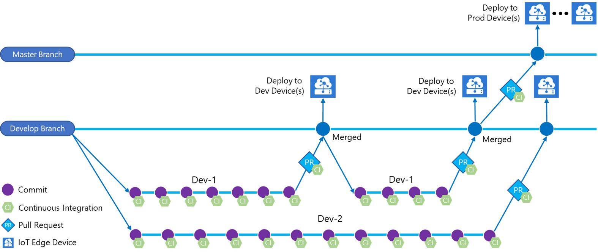

# Azure IoT Edge Plugin

A Jenkins plugin for continuous integration(build and push docker image) and continuous deployment(create Edge deployment on Azure)

## Feedback
* If you encounter any bugs with this plugin please file an issue in [Jenkins JIRA](https://issues.jenkins-ci.org) under component `azure-iot-edge-plugin`.

* You can also contact this Email group for issues `vsciet@microsoft.com`

## Overview
This is the work flow for Azure IoT Edge solution CI/CD pipeline.


## How to Install

You can install/update this plugin in Jenkins update center (Manage Jenkins -> Manage Plugins, search Azure IoT Edge Plugin).

You can also manually install the plugin if you want to try the latest feature before it's officially released.
To manually install the plugin:

1. Clone the repo and build. (The integration test need about 30 minutes to run, you can skip by following command):
   ```
   mvn package -Dmaven.test.skip=true
   ```
2. Open your Jenkins dashboard, go to Manage Jenkins -> Manage Plugins.
3. Go to Advanced tab, under Upload Plugin section, click Choose File.
4. Select `azure-iot-edge.hpi` in `target` folder of your repo, click Upload.
5. Restart your Jenkins instance after install is completed.

## Prerequisites

To use this plugin to build and deploy Azure IoT Edge solution, first you need to have an Azure Service Principal in your Jenkins instance.

1. Create an Azure Service Principal through [Azure CLI](https://docs.microsoft.com/en-us/cli/azure/create-an-azure-service-principal-azure-cli?toc=%2fazure%2fazure-resource-manager%2ftoc.json) or [Azure portal](https://docs.microsoft.com/en-us/azure/azure-resource-manager/resource-group-create-service-principal-portal).
2. Open Jenkins dashboard, go to Credentials, add a new Microsoft Azure Service Principal with the credential information you just created.
3. Install following tools on Jenkins host. (If your Jenkins host is Windows, then the docker container needs to be Linux container)
    * [Docker](https://docs.docker.com/install/)
    * [Azure CLI](https://docs.microsoft.com/en-US/cli/azure/install-azure-cli)
    * [Azure CLI IoT Extension](https://github.com/Azure/azure-iot-cli-extension#quick-guide)
    * iotedgedev `pip install iotedgedev`

## Create a Freestyle project
### Build and Push task

1. In `Build` section, click `Add build step`, then choose `Azure IoT Edge Build and Push`. 
2. Set `Solution Root Path`, in most cases it's where deployment.template.json located.
3. Set `Bypass modules`, it is the list of modules to bypass when building, use comma delimited list of modules. Example "ModuleA,ModuleB". You can leave this field empty to build all modules.
4. Choose docker registry in `Docker Credential Configuration`.
  * For Azure Container Registry, you need to use the Azure Service Principal created above to authenticate.
  * For other types of registry(docker hub), you need to specify `Docker registry URL` and then a credential with type `Username with password`.

### Deploy task

1. In `Build` section, click `Add build step`, then choose `Azure IoT Edge Deploy`. 
2. Set `Solution Root Path`, in most cases it's where deployment.template.json located.
3. Choose Azure IoT Hub.
4. Set deployment configurations. You can click `help` button after the input box to get detailed explanation of the item.

## Create a Pipeline project

You can also use this plugin in pipeline (Jenkinsfile). Here are some samples to use the plugin in pipeline script:

### Build and Push task

#### Use Azure Container Registry
```groovy
azureIoTEdgePush dockerRegistryType: 'acr', acrName: '<acr_name>', bypassModules: '', azureCredentialsId: '<azure_credential_id>', resourceGroup: '<resource_group_name>', rootPath: '<solution_root_path>'
```

#### Use common Container Registry
```groovy
azureIoTEdgePush dockerRegistryType: 'common', dockerRegistryEndpoint: [credentialsId: '<credential_id>', url: '<url>'], bypassModules: '', resourceGroup: '<resource_group_name>', rootPath: '<solution_root_path>'
```

### Deploy task 
#### For single device
```groovy
azureIoTEdgeDeploy azureCredentialsId: '<azure_credential_id>', deploymentId: '<deployment_id>', deploymentType: 'single', deviceId: '<device_id>', iothubName: '<iothub_name>', priority: '<priority>', resourceGroup: '<resource_group_name>', rootPath: '<solution_root_path>', targetCondition: ''
```

#### For multiple devices using target condition
```groovy
azureIoTEdgeDeploy azureCredentialsId: '<azure_credential_id>', deploymentId: '<deployment_id>', deploymentType: 'multiple', targetCondition: '<target_condition>', iothubName: '<iothub_name>', priority: '<priority>', resourceGroup: '<resource_group_name>', rootPath: '<solution_root_path>', targetCondition: ''
```

For advanced options, you can use Jenkins Pipeline Syntax tool to generate a sample script.

## Data/Telemetry
Azure IoT Edge Plugin for Jenkins collects usage data and sends it to Microsoft to help improve our products and services. Read our [privacy statement](http://go.microsoft.com/fwlink/?LinkId=521839) to learn more.  
You can turn off usage data collection in Manage Jenkins -> Configure System -> Azure -> Help make Azure Jenkins plugins better by sending anonymous usage statistics to Azure Application Insights.